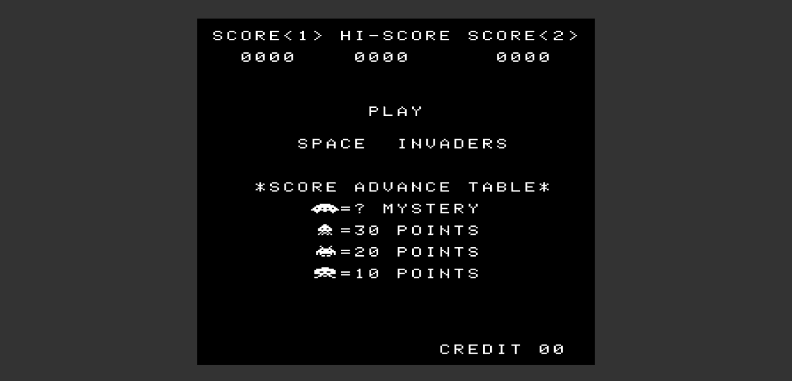

## Description
This is my implemention of Intel 8080 emulator running Space Invaders. Here, I am using WebGL to implement the display. This currently runs slow and requires a lot of debugging.

This project is in it's early stages and I still need to implement Sound and Input instructions.

Doing this mainly to learn about the working of CPU hardware, assembly and some WebGL.  

Currently the game reaches the menu screen as shown below and bugs out right before going into attract mode.

  

## Usage
1. Start a local server. This requires a local web server because of xhr calls made to load the program's ROM.
2. Open index.html through that server.
3. Requires a WebGL enabled browser.

## Features
- Complete implementation of Intel 8080 Instruction Set.
- Display implemented using WebGL, so efficient utilisation of GPU which takes the load off of CPU and can even achieve full screen.
